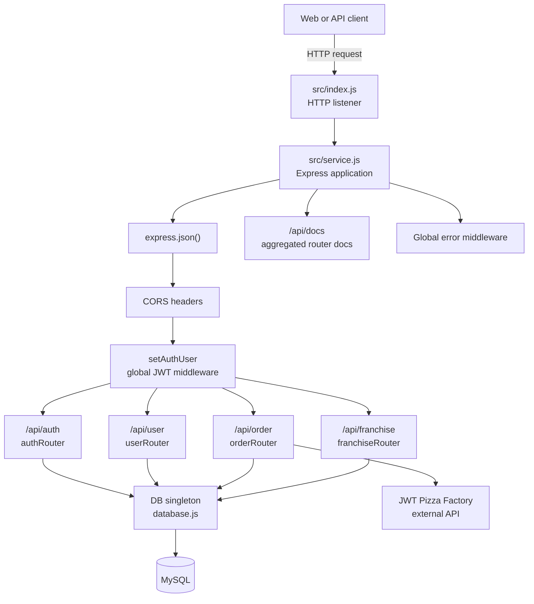
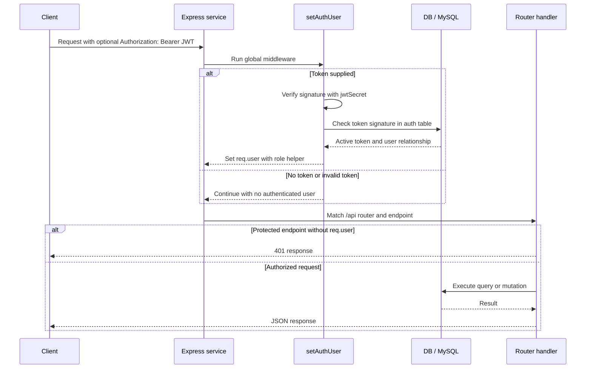
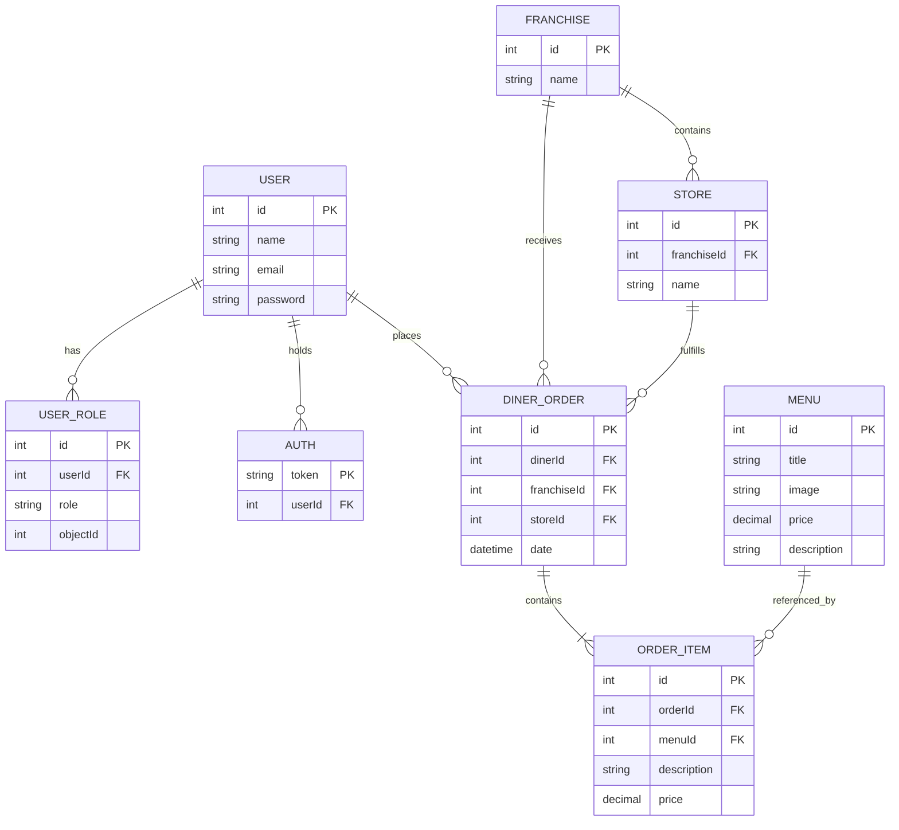
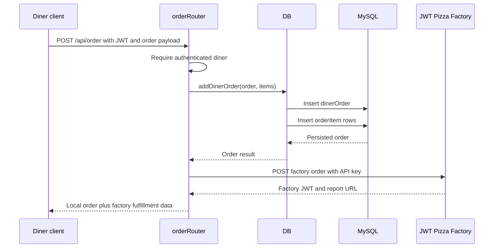

# JWT Pizza Service Architecture

This service is the backend for JWT Pizza. It manages accounts, roles, franchises, stores, menu items, and local order history. When a diner places an order, the service records it locally and forwards it to the external Pizza Factory, which produces the pizza and returns fulfillment information.

The application is a small CommonJS Node.js service built on Express. Its architecture is intentionally direct: routers hold HTTP concerns and authorization decisions, while a shared database singleton owns SQL access and schema setup.

## Orientation Map

| Area | Main files | Responsibility |
| --- | --- | --- |
| Process startup | `src/index.js` | Starts the HTTP listener. |
| Application composition | `src/service.js` | Configures Express, middleware, routers, docs, and error handling. |
| Authentication | `src/routes/authRouter.js` | Registers, logs in, logs out, creates JWTs, and populates `req.user`. |
| User operations | `src/routes/userRouter.js` | Exposes the current user and profile updates. |
| Franchise operations | `src/routes/franchiseRouter.js` | Manages franchises, franchise administrators, and stores. |
| Orders and menu | `src/routes/orderRouter.js` | Lists and creates menu items, records orders, and invokes Pizza Factory. |
| Persistence | `src/database/database.js` | Initializes MySQL and provides all database operations. |
| Schema | `src/database/dbModel.js` | Defines the SQL tables and initial seed data. |
| Shared HTTP helpers | `src/endpointHelper.js` | Wraps async endpoints and provides status-code-aware errors. |
| Configuration | `src/config.js` | Supplies the JWT secret, MySQL connection, pagination size, and Pizza Factory credentials. |

## Startup And Composition

`npm start` runs `node src/index.js`. The entry point imports the configured Express application and listens on port `3000`, unless a port is supplied as the first command-line argument.

Importing `service.js` assembles the application:

1. Express is created and JSON request-body parsing is enabled.
2. Global middleware applies CORS headers and calls `setAuthUser` for every request.
3. The auth, user, order, and franchise routers are mounted below `/api`.
4. `/api/docs` aggregates each router's `docs` metadata into a single endpoint reference.
5. A final error middleware serializes exceptions as JSON using the error's status code, or `500` when none is set.

The database singleton is initialized during module loading. It creates the configured database and tables when needed, then seeds the default administrator on a new database. Database calls wait for that initialization before issuing queries, so the server can begin listening while initialization completes.



## Request Lifecycle

All API requests first pass through `setAuthUser`, even public endpoints. The middleware attempts to extract a bearer token from `Authorization`, verifies it with `jsonwebtoken`, and checks that its token signature remains in the `auth` table. When successful, it attaches the decoded JWT to `req.user` along with `isRole(role)`. Missing or invalid credentials leave `req.user` empty; public handlers can continue, while protected handlers call `authenticateToken` and return `401`.

Route handlers are wrapped with `asyncHandler`. This forwards rejected promises to Express's central error middleware instead of leaving an unhandled async failure. Business and authorization failures use `StatusCodeError`, allowing handlers and database methods to communicate the intended HTTP status.



## Authentication And Authorization

### Account lifecycle

`authRouter` is responsible for the login lifecycle:

- `POST /api/auth` registers a user, hashes the password with bcrypt, assigns the default `Diner` role, and returns a newly issued JWT.
- `PUT /api/auth` validates a user's password and returns their user data plus a new JWT.
- `DELETE /api/auth` logs out by removing the token signature from the `auth` table.

JWTs are therefore not the only source of truth. A cryptographically valid JWT must also be represented in `auth`; deleting its stored signature revokes that session without changing the application's signing secret.

### Roles

Roles are defined in `src/model/model.js`. The service recognizes `Admin`, `Franchisee`, and `Diner` roles. `Admin` is global. A franchisee role uses `userRole.objectId` to scope permission to one franchise, which lets one user administer multiple franchises independently.

Authorization is deliberately close to the routes it protects. Typical checks are:

- `authenticateToken` requires an authenticated request.
- `req.user.isRole(Role.Admin)` grants system-wide administrative authority.
- Franchise routes additionally look up whether the caller is an administrator for the target franchise.
- User updates allow an administrator to update any user and a diner to update only their own account.

## HTTP API Boundaries

All routers are mounted below `/api`. Use `GET /api/docs` as the runtime source of endpoint details and request examples.

| Router | Base path | Main responsibility |
| --- | --- | --- |
| `authRouter` | `/api/auth` | Registration, login, logout, and token issuance. |
| `userRouter` | `/api/user` | Current-user information and user profile updates. |
| `franchiseRouter` | `/api/franchise` | Franchise listing/creation/deletion and nested store management. |
| `orderRouter` | `/api/order` | Menu access and administration, order history, and placement. |

Some useful endpoint families are:

- `GET /api/order/menu` is public; `PUT /api/order/menu` is administrative.
- `GET /api/order` returns the authenticated diner's order history; `POST /api/order` records and submits an order.
- `GET /api/franchise` is public and supports filtered, paginated listing. Administrative callers receive richer franchise information.
- Nested franchise store endpoints manage stores under `/:franchiseId/store` and require either global or franchise-specific administration.

## Persistence Model

`database.js` exports a singleton `DB` instance. It uses `mysql2/promise`, exposes methods such as user, role, franchise, store, menu, and order operations, and is the only layer that should contain SQL. Routers should call these methods rather than issue queries directly.

The schema is defined in `dbModel.js` and has the following conceptual relationships:



Important modeling choices:

- Passwords are bcrypt hashes, never plaintext after registration or update.
- `userRole` is a join-style table rather than a single column on `user`, so role memberships can be multiple and scoped.
- `orderItem` retains description and price data at purchase time. This preserves the effective order record even when the menu later changes.
- Store revenue is derived by joining stores, orders, and order items and summing item prices.
- Pagination uses `config.db.listPerPage` and SQL `LIMIT`/`OFFSET`; maintain that convention when adding collection endpoints.

## Order Submission: The Cross-Service Flow

Order creation is the most important integration path. The order router validates authentication and authorization, persists the order and line items locally, then calls the Pizza Factory configured by `factory.url` using the configured API key. The factory response supplies a JWT and a report URL that the service returns to the caller.

The local record is created before the factory call. Consequently, a factory failure can leave a locally recorded order without a successful factory fulfillment. Treat this as an operational behavior to understand before changing error handling, retries, or reconciliation.



## Configuration And External Dependencies

`src/config.js` is intentionally deployment-specific and is required for the service to run. It must provide:

| Setting | Used for |
| --- | --- |
| `jwtSecret` | Signing and verifying application JWTs. |
| `db.connection` | MySQL host, credentials, database name, and connection timeout. |
| `db.listPerPage` | Default result count for paginated queries. |
| `factory.url` | Base URL for the Pizza Factory API. |
| `factory.apiKey` | Credential sent when submitting orders to Pizza Factory. |

The runtime dependencies are Express, `jsonwebtoken`, `mysql2`, and bcrypt. There is no ORM, queue, cache, or background worker: request handlers execute their database and Pizza Factory work synchronously within the request lifecycle.

## Practical Development Guide

1. Start by reading `service.js`, then the router that owns the API behavior you are changing. This reveals middleware order and the relevant authorization boundary.
2. Trace the router call into `database.js` to understand what is persisted and which status errors can be raised.
3. Add or adjust SQL only through the `DB` abstraction; update `dbModel.js` when a fresh deployment must create new schema.
4. Add endpoint documentation to the router's `docs` collection so `/api/docs` remains accurate.
5. For new protected endpoints, choose whether the requirement is authentication, global administration, or franchise-scoped administration, and apply the existing check closest to the handler.
6. Test the Pizza Factory path with valid deployment configuration. It is the only external call and carries different failure modes from local CRUD requests.

Run the service with:

```sh
npm install
npm start
```

For a non-default port, run `node src/index.js <port>`. The `src/init.js` command can create an initial administrator with `node src/init.js <name> <email> <password>`.